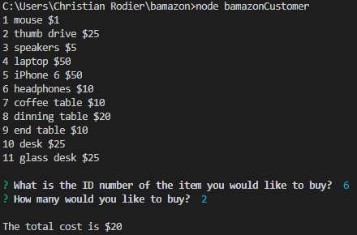
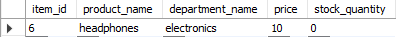

Made in Node.JS & SQL

1. In mySql, create a database w/ the name bamazon & inside that data base a table called products. See the file bamazon-sql.sql for more ideas.
2. In your comand line interface, type in 'node bamazonCustomer' to open the application.

3. Select the Id number and the quantity of the amount you want

Bamazon will tell you the price & if the item you want is in stock. Finally, the data base will be updated.

If there is not enough in stock Bamazon will prompt you.

Happy Shopping!